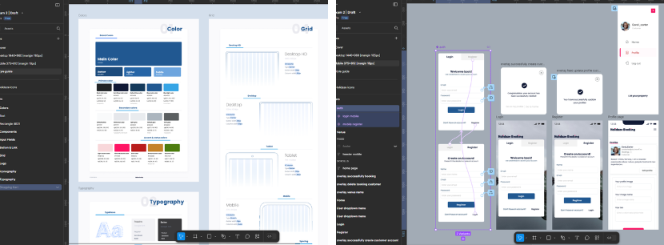

# Holidaze Booking | Project Exam 2 | React, TypeScript & Tailwind

This project serves as an exam, demonstrating the skills learned over the last two years and take on an extensive project where the finished product reflects acquired general development capabilities, in addition to visual and technical skills.

## Development Environment

To set up the development environment:

1. Fill `.env` following `.env.example`:
   - Specify VITE_API_BASE_URL (the base API url `https://v2.api.noroff.dev`)
   - Specify VITE_API_KEY (the tenant GUID obtained from the `API Key` endpoint)
2. Ensure you have Node.js installed (> 20).
3. Clone the repository.
4. Run the following commands

```console
> npm install
> npm run start
```

### Running Tests

To run the tests, simply use the following command:

```console
> npm install
> npm run test
```

## Documentation

| Content    | Link                                                                                                                                | Description                    |
| ---------- | ----------------------------------------------------------------------------------------------------------------------------------- | ------------------------------ |
| Brief      | [Brief](docs/brief.pdf)                                                                                                             | The project's requirements     |
| Criteria   | [Criteria](docs/criteria.pdf)                                                                                                       | Criteria with all requirements |
| Repository | [Repository](https://github.com/FP22FD/holidaze-booking)                                                                            | The GitHub repository          |
| Netlify    | [Hosted demo on Netlify](https://holidaze-booking-ca.netlify.app/)                                                                  | Hosted demo on Netlify         |
| Kanban     | [Kanban Project board](https://github.com/users/FP22FD/projects/9/views/1)                                                          | The project kanban board tasks |
| Tests      | [Tests](docs/test.png)                                                                                                              | Visual tests coverage          |
| Mobile     | [Figma Prototype](https://www.figma.com/proto/logD4DCp2N2cqDv2HGcswu/7.Exam-2-%7C-Draft?page-id=4755%3A982&node-id=16116-6809)      | Figma design prototype         |
| Desktop    | [Figma Prototype](https://www.figma.com/proto/logD4DCp2N2cqDv2HGcswu/7.Exam-2-%7C-Draft?page-id=15256%3A52195&node-id=15304-143945) | Figma design prototype         |
| Design     | [Design System Guide](docs/designs/styleGuide.pdf)                                                                                  | Style guidelines               |

## Design Overview

In this project, I used Figma to create high-fidelity designs for both mobile and desktop versions. Below is a preview showcasing the `Design System` and the prototyping process conducted in Figma:



## Description

The primary goal of this project is to apply React skills to create a web application platform.
It integrates modern web development techniques and tools to improve both user experience (UX) and code quality.

## Key Features and Technologies

- CSS framework: Use `Tailwind` CSS for utility-first design, enabling faster design implementation and responsive design.
- REST API: Implements CRUD API features, primarily focusing on GET, POST, PUT, and DELETE requests for working with required data.
- TypeScript: The code is written strongly-typed using `TypeScript`, lowering the chance of bugs, obtaining a better code quality, and improving the DX (`Developer Experience`).
- React Topics: `functional components`, `component composition`, `useState`, `useEffect`, `AbortController`, `custom hooks` and `UseContext`.
- Routing: `react-router-dom 6.x` with custom `Error Boundary`.
- Strongly Typed Forms: Using `Yup` and `react-hook-form` to manage user validation and proper user feedback, and strongly typed.
- Unit Testing and Browser Testing: Using `vitest` (`Jest` compatible) to implement browser testing (Playwright) to automate the correctness of the Authentication forms.
- Global State Management: `UseContext` for managing user data and preventing prop drilling.
- Storage: `Local Storage` to store application state, such as user data and token, ensuring data persistence across page reloads and browser sessions.
- SEO: Enhanced with `Helmet` async package, for dynamic custom titles and descriptions for each page.
- Environment Variables: Use `.env` to avoid to expose sensitive data.

- Javascript/TypeScript Techniques:

  - Array functions: `filter`, `map`, `Array.from`, `entries`, `findIndex`, `includes`, `sort` and `reduce`.
  - Destructuring for cleaner code
  - Development Tools: Uses `Vite` as a bundler and follows a streamlined workflow with tools like `Eslint` and `Prettier`.

### Calendar Implementation

For the booking functionality in the Holidaze Booking app, I integrate a custom calendar using the [`@demark-pro/react-booking-calendar`](https://www.npmjs.com/package/@demark-pro/react-booking-calendar) package.
This calendar allows users to book only the available dates for a venue, based on the required number of guests, finalizing the booking accordingly.

#### Evaluation Process

Before selecting this package, I followed these steps to ensure it met the necessary standards for integration into the project:

1. Documentation: I reviewed the package's documentation to ensure it was clear and easy to understand.
2. Downloads: I checked the number of weekly downloads to gauge the package's popularity and reliability.
3. Support & Maintenance: I evaluated the ongoing support by reviewing the Issues tab to confirm that open issues were being addressed in a timely manner, and checked the last update to ensure the package was still actively maintained.
4. Fallback Plan: In case the package is discontinued, I ensured it had a relatively stable codebase and could be easily replaced with an alternative if necessary.

By following these steps, I was able to choose a package that fits the needs of the project while ensuring long-term reliability.

- Customizable Booking Calendar: The calendar provides an intuitive interface for users to select booking dates.
- Availability Management: Dates are displayed based on the Venue's availability, helping users easily identify when a Venue is available.
- Responsive Design: The calendar is optimized for both mobile and desktop views, ensuring a seamless experience across devices.

You can find the package documentation and additional configuration options [here](https://github.com/demark-pro/react-booking-calendar#readme).

### Testing

Tests were not required for this project. However I have implemented unit tests for the authentications form to ensure the correct functionality.

- Unit Testing:

  - Implement `vitest` for testing authentication form components and API calls ensuring each piece works as expected.

### Development Practices

- Responsive Design: Ensures optimal user experience across devices using media queries.
- Code Quality: Follows `DRY principles` (Don’t Repeat Yourself) for structured and maintainable code.
- Developer Tools: Utilizes tools such as `VS code`, `DevTools`, `GitHub`, and `Postman` for development and testing.
- Code Validation: Employs validation tools to ensure standards compliance.
- Mobile First: The design prioritizes mobile responsiveness, ensuring an optimal experience on mobile devices before adapting to large.

### Code Organization

- Components with single responsibility and Reusable, following this pattern the application is split into smaller composable components.
- Folder Structure: The project follows `Vertical Slices` approach organizing the code by feature.

- UX improvements:

  - Accessibility: Implement `WCAG` (Web Content Accessibility Guidelines) standards for improved user accessibility.
  - Navigation & Structure: Use semantic `HTML`, ARIA labels, and Tailwind focus utilities to improve navigation, structure, accessibility, and user experience (UX).
  - Design: Implement custom fonts, a consistent color palette, and reusable components like headers and VenueCards for a cohesive look.
  - Responsive Design: Optimize booking calendar and layouts for both desktop and mobile users.
  - User Flow: Simplified authentication with tabs for login and registration, plus a dedicated manager registration process.
  - Interactive Features: Add a booking confirmation modal and hover effects for improved feedback and engagement.
  - Planning: Design user flows in Figma and managed tasks via GitHub Projects for a streamlined development process.

## Additional Information

While the course assignment required JavaScript, I chose to use `TypeScript` to enhance code quality.
This decision allows for strongly typed code and establishes clear API data contracts, improving maintainability and reducing potential errors.

## API

The application interacts with the Holidaze Booking API.
The API documentation can be found [here](https://docs.noroff.dev/docs/v2).
API Routes: The API requires both a JWT token and an API Key but does not require authentication for the home page and Venue detail pages.

## Feature implemented

- a `guest` user can:

  - accesses the site without authentication
  - view a list of Venues
  - browse and search for specific Venue
  - view specific Venue details
  - view a calendar with available dates for a Venue
  - a user with a `@stud.noroff.no` email can register as a `customer` or a `manager`

- a `customer` user can:

  - log in to book a Venue
  - view their upcoming bookings
  - update their profile, such as their avatar
  - log out from their account

- a `manager` user can:

  - log in to create, update or delete Venues they manage
  - view bookings for a Venue they manage
  - update their profile, such as their avatar
  - log out of their account

## Validation

The web application code has been validated using the following tools:

- [check html validity](https://validator.w3.org/)
- [check css validity](https://jigsaw.w3.org/css-validator/)
- [check redirect links](https://validator.w3.org/checklink)
- [check accessibility](https://www.accessibilitychecker.org/)

## Resource

- Icons: [React Icons](https://react-icons.github.io/react-icons/icons/pi/)
- Calendar: [React Calendar](https://www.npmjs.com/package/@demark-pro/react-booking-calendar)
- Calendar documentation: [GitHub Calendar](https://github.com/demark-pro/react-booking-calendar#readme)
- Calendar implementation: [Calendar ref](https://stackoverflow.com/a/44906207)
